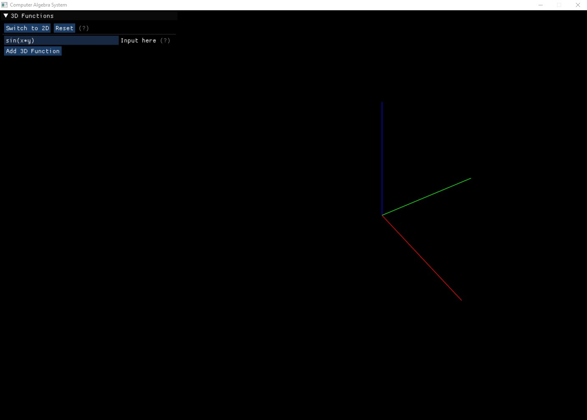

# Computer-Algebra-System 

This project is a [Computer Algebra System](https://en.wikipedia.org/wiki/Computer_algebra_system) coded in Java from scratch. It supports the majority of elementary functions. 

This Computer Algebra System contains: 
* A tree-like data structure to hold any mathematical expression in memory. This is the core of the project and consists of more than half of it.
* Parsing any mathematical expression into this expression tree
* Display this mathematical expression beautifully using LaTeX
* Simplify this expression algebraically
* Find the symbolic partial derivatives of the mathematical expression with respect to any variable
* Graph the expression in both 2D and 3D
___

## Presentation

Here is what it looks like when you launch the application. It defaults to the 3D plotter, you can switch between the 3D and 2D plotter with the button on the top left corner. 

Here is an example with a single function of form . You can see the system automatically computes both partial derivatives 

___

## How to use it

Here is a list of the supported functions and examples of syntax the parser can understand. For most functions, brackets are necessary if the input is not a number or a variable. Unless stated otherwise. Also, the multiplication symbol is mandatory. An expression like "5x" will not work, it must be "5 * x".

* Trigonometry: Write the name of the function and then the input. 
    * sin, cos and tan. Ex: "x * sinx", "a * x * cos(b * x)"
    * arcsin, arccos, arctan. Ex: "arcsin(a / x)", "arctanx"
    * csc, sec, cot. Ex: "csc(x + b)", "cotx + b"
* Floor function. Ex: "floorx", "floor(x^2 + 15)"
* Ceiling function. Ex: "ceilx", "ceil(5 * b * x + 0.1)"
* Absolute value function. Ex: "absx", "abs5", "abs(x^3)"
* Logarithms. Ex: "lnx", "ln(5 * x)", "logx", "log_5_x", "log_(x + 5)_(x^2)"
* Minimum and Maximum functions. The functions take an arbitrary amount of inputs greater than 1. You must surround those inputs in brackets and separate them with commas. Ex: "min(5, x)", "max(x, x^2, 15, 7 / x)", "min(17, x^3, 7 * x)"
* Modulus function. This function must take 2 inputs, separated by a comma and must be surrounded by brackets. Ex: "mod(x, 5)", "mod(x^2 + x + 15, x^3)"
* Sign function. Ex: "signx", "sign(-x + 5)", "sign(x^2 + x - 15)"

